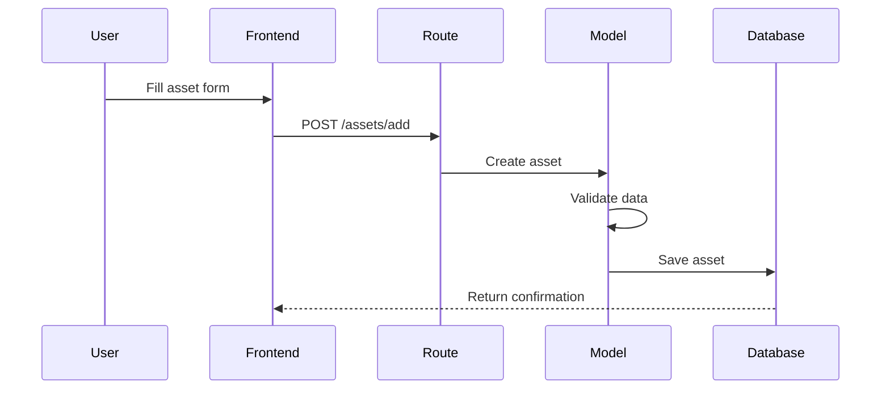
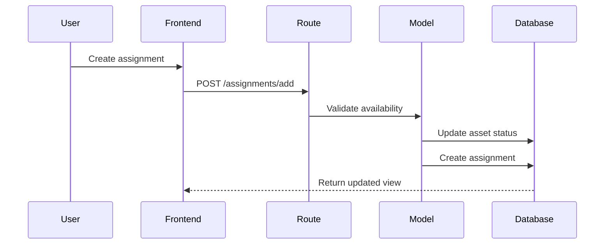

# System Architecture

## Overview
The IT Asset Management System is built using a modular Flask application architecture with Blueprint-based routing and SQLAlchemy ORM for database management.

## Core Components

### 1. Application Structure
```
it_asset_manager/
├── app/
│   ├── models/
│   ├── routes/
│   ├── static/
│   └── templates/
├── data/
└── config.py
```

### 2. Key Components

#### Database Layer
- SQLAlchemy ORM
- Models: Asset, Employee, Assignment
- Relationship mappings and constraints
- Data validation and type checking

#### Route Layer (Blueprints)
- assets_bp: Asset management routes
- employees_bp: Employee management routes
- assignments_bp: Assignment management routes

#### Template Layer
- Jinja2 templating
- Partial templates for HTMX updates
- Base template inheritance

#### Frontend
- HTMX for dynamic updates
- Tailwind CSS for styling
- Modular JavaScript for interactions

## Data Flow

### 1. Asset Creation Flow


### 2. Assignment Flow


## Security Considerations

### 1. Input Validation
- Form data validation
- Asset tag uniqueness
- Status transitions
- Date format validation

### 2. Error Handling
- Global error handlers
- Transaction rollback
- User feedback
- Logging

## Performance Optimization

### 1. Database
- Indexed fields
- Efficient queries
- Relationship lazy loading

### 2. Frontend
- Partial updates with HTMX
- Efficient DOM updates
- Asset bundling

## Integration Points

### 1. QR Code System
- Generation on asset creation
- Base64 encoded images
- Modal display system

### 2. Asset Status Updates
- Real-time status changes
- Assignment tracking
- Maintenance status

## Deployment Architecture

### 1. Development
- SQLite database
- Debug mode
- Local static file serving

### 2. Production
- Production database (configurable)
- WSGI server
- Static file optimization
